# Krista Client Authentication Extension - Architecture Documentation

**Version:** 3.5.7  
**Last Updated:** 2026-01-16  
**Extension Type:** Authentication Provider  
**Java Version:** 21

---

## Table of Contents

1. [Overview](#overview)
2. [5-Layer Architecture](#5-layer-architecture)
3. [Component Architecture](#component-architecture)
4. [Authentication Flow](#authentication-flow)
5. [Request Processing Flow](#request-processing-flow)
6. [Error Handling Architecture](#error-handling-architecture)
7. [Performance Characteristics](#performance-characteristics)
8. [Security Architecture](#security-architecture)
9. [Deployment Architecture](#deployment-architecture)
10. [Limitations and Constraints](#limitations-and-constraints)

---

## Overview

The Krista Client Authentication extension provides session-based authentication for Krista Web and Mobile clients. It implements the `RequestAuthenticator` interface to intercept and authenticate incoming HTTP requests using cookie-based session management.

### Key Architectural Principles

- **Layered Architecture**: Clear separation of concerns across 5 distinct layers
- **Dependency Injection**: HK2-based DI for loose coupling
- **Stateless Design**: No local state; all session data managed by platform SessionManager
- **Protocol Agnostic**: Designed for HTTP but extensible to other protocols
- **Security First**: HttpOnly cookies, HTTPS support, CORS validation

### Extension Metadata

```yaml
Name: Krista Client Authentication
Domain ID: catEntryDomain_db053e8f-a194-4dde-aa6f-701ef7a6b3a7
Domain Name: Authentication
Ecosystem: Krista
JAX-RS ID: authn
Admin Rights: Required
Java Version: 21
```

---

## 5-Layer Architecture

The extension follows a strict 5-layer architecture pattern consistent with Krista extension design principles.

```mermaid
graph TB
    subgraph "Layer 1: Extension Layer"
        EXT[KristaClientAuthenticationExtension<br/>@Extension @Domain @StaticResource]
    end
    
    subgraph "Layer 2: Application Layer"
        APP[KristaClientApplication<br/>@ApplicationPath JAX-RS Config]
    end
    
    subgraph "Layer 3: API/Resource Layer"
        API[AuthenticationResource<br/>@Path REST Endpoints]
    end
    
    subgraph "Layer 4: Service/Logic Layer"
        SVC[KristaClientRequestAuthenticator<br/>implements RequestAuthenticator]
    end
    
    subgraph "Layer 5: Utility/Helper Layer"
        UTIL1[ApiConstants<br/>Constants]
        UTIL2[ApiUtility<br/>Cookie Parsing]
    end
    
    subgraph "External Dependencies"
        SM[SessionManager<br/>Platform Service]
        INV[Invoker<br/>Platform Service]
    end
    
    EXT -->|provides| SVC
    EXT -->|configures| APP
    APP -->|registers| API
    API -->|uses| SM
    API -->|uses| INV
    SVC -->|uses| SM
    SVC -->|uses| INV
    SVC -->|uses| UTIL2
    API -->|uses| UTIL1
    API -->|uses| UTIL2
    
    style EXT fill:#e1f5ff
    style APP fill:#fff4e1
    style API fill:#ffe1f5
    style SVC fill:#e1ffe1
    style UTIL1 fill:#f5f5f5
    style UTIL2 fill:#f5f5f5
    style SM fill:#ffe1e1
    style INV fill:#ffe1e1
```

### Layer 1: Extension Layer

**Class:** `KristaClientAuthenticationExtension`

**Responsibilities:**
- Bootstrap the authentication extension
- Register with Krista platform
- Provide `RequestAuthenticator` implementation via `@InvokerRequest`
- Configure static resources (documentation)
- Define custom tabs for UI

**Key Annotations:**
```java
@Extension(
    implementingDomainIds = "catEntryDomain_db053e8f-a194-4dde-aa6f-701ef7a6b3a7",
    jaxrsId = "authn",
    requireWorkspaceAdminRights = true,
    name = "Krista Client Authentication",
    version = "3.5.7"
)
@Domain(id = "catEntryDomain_db053e8f-a194-4dde-aa6f-701ef7a6b3a7", name = "Authentication")
@StaticResource(path = "docs", file = "docs")
```

**Dependencies:**
- `Invoker` (injected)
- `SessionManager` (injected)

**Invoker Requests:**
1. `AUTHENTICATOR` - Returns `KristaClientRequestAuthenticator` instance
2. `CUSTOM_TABS` - Returns documentation tab configuration

---

### Layer 2: Application Layer

**Class:** `KristaClientApplication`

**Responsibilities:**
- Configure JAX-RS application
- Register REST resource classes
- Configure message body handlers (JSON serialization)

**Key Annotations:**
```java
@Service
@ContractsProvided(Application.class)
@ApplicationPath("/")
```

**Configuration:**
- **Resources:** `AuthenticationResource.class`
- **Singletons:** `GsonMessageBodyHandler` for JSON processing
- **Base Path:** `/` (combined with JAX-RS ID becomes `/authn`)

---

### Layer 3: API/Resource Layer

**Class:** `AuthenticationResource`

**Responsibilities:**
- Handle HTTP authentication requests
- Implement REST API endpoints
- Manage CORS headers
- Deliver client-side JavaScript authenticator

**Endpoints:**

| Method | Path | Purpose | Response |
|--------|------|---------|----------|
| POST | `/login` | Authenticate user with session ID | 202 Accepted + Set-Cookie |
| OPTIONS | `/login` | CORS preflight handler | 200 OK + CORS headers |
| GET | `/authenticator` | Deliver JavaScript client | 200 OK + JavaScript code |

**Dependencies:**
- `SessionManager` (injected)
- `Invoker` (injected)

**Key Features:**
- CORS support with dynamic origin handling
- Cookie creation with security attributes
- JavaScript template substitution
- Cache control for static resources

---

### Layer 4: Service/Logic Layer

**Class:** `KristaClientRequestAuthenticator`

**Responsibilities:**
- Implement `RequestAuthenticator` interface
- Extract and validate session cookies
- Authenticate incoming requests
- Handle authentication failures with redirects

**Interface Methods:**

| Method | Return Type | Purpose |
|--------|-------------|---------|
| `getScheme()` | String | Returns "Krista" |
| `getSupportedProtocols()` | Set\<String\> | Returns ["HTTP"] |
| `getAuthenticatedAccountId()` | String | Extract account ID from request |
| `getMustAuthenticateResponse()` | ProtoResponse | Return 302 redirect to login |
| `setServiceAuthorization()` | boolean | Not supported (returns false) |
| `getAttributeFields()` | Map | No custom attributes (returns empty) |

**Authentication Algorithm:**
```
1. Extract Cookie header from HTTP request
2. Parse X-Krista-Context cookie using ApiUtility
3. Extract clientSessionId from cookie JSON
4. Call SessionManager.lookupAccountId(clientSessionId)
5. If account found → return account ID
6. If null and login API requested → extract from request body
7. Otherwise → return null (triggers MustAuthenticateException)
```

**Dependencies:**
- `Invoker` (for routing info)
- `SessionManager` (for session validation)
- `Gson` (for JSON parsing)

---

### Layer 5: Utility/Helper Layer

#### ApiConstants

**Purpose:** Define application-wide constants

**Constants:**
```java
X_KRISTA_SESSION_ID = "X-Krista-Session-Id"
X_KRISTA_ORIGINAL_URL = "X-Krista-Original-URI"
X_KRISTA_CONTEXT = "X-Krista-Context"
COOKIE = "Cookie"
LOGIN_API = "/login"
CLIENTSESSIONID = "clientSessionId"
BASE_URI_KEYWORD_TO_BE_REPLACED = "__BASE_URI__"
```

#### ApiUtility

**Purpose:** Cookie parsing and session ID extraction

**Key Methods:**

| Method | Parameters | Returns | Purpose |
|--------|------------|---------|---------|
| `getClientSessionIdFromCookie()` | String cookie | String | Extract session ID from cookie |
| `parseClientSessionIdFromCookie()` | String cookie | String | Parse and decode cookie value |
| `decodeRequestContext()` | String encoded | JsonObject | URL decode and parse JSON |

**Cookie Parsing Algorithm:**
```
1. Check if cookie contains "clientSessionId"
2. Parse cookies using CookiesParser.parseCookies()
3. Extract "X-Krista-Context" cookie
4. URL decode the cookie value
5. Parse JSON using Gson
6. Extract "clientSessionId" field
7. Return session ID or null
```

---

## Component Architecture

### Component Interaction Diagram

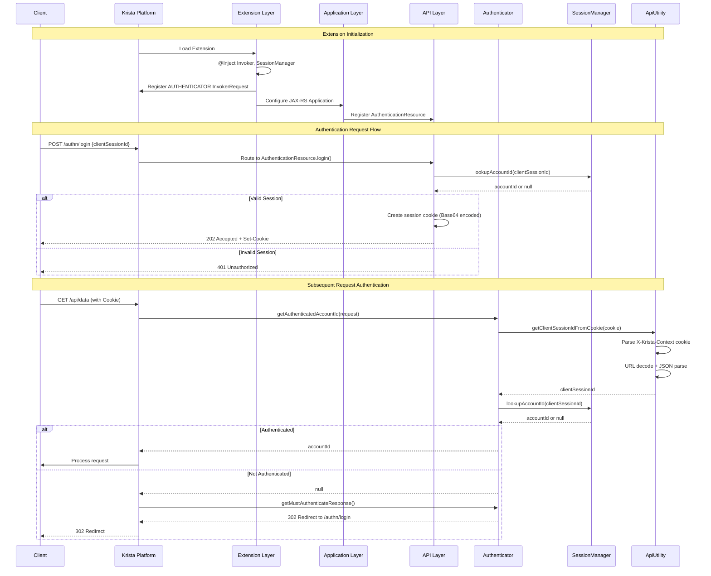

### Dependency Graph

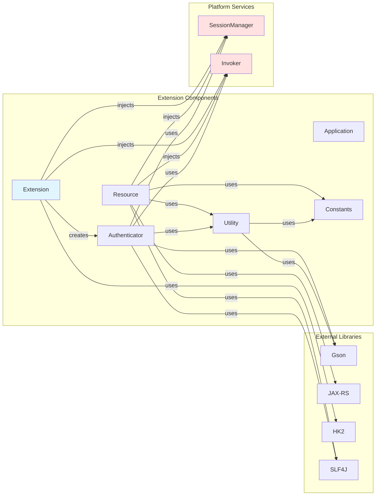

---

## Authentication Flow

### Initial Login Flow

```mermaid
flowchart TD
    Start([Client Application]) --> A[Obtain clientSessionId<br/>from Krista Device Registration]
    A --> B[POST /authn/login<br/>Body: {clientSessionId}]
    B --> C{Cookie Header<br/>Present?}
    C -->|Yes| D[Extract from Cookie]
    C -->|No| E[Extract from Request Body]
    D --> F[SessionManager.lookupAccountId]
    E --> F
    F --> G{Account ID<br/>Found?}
    G -->|Yes| H[Base64 Encode Session ID]
    G -->|No| I[Return 401 Unauthorized]
    H --> J[Create Session Cookie<br/>HttpOnly, Secure, SameSite]
    J --> K[Add CORS Headers<br/>Allow-Origin, Allow-Credentials]
    K --> L[Return 202 Accepted<br/>+ Set-Cookie Header]
    L --> M([Client Stores Cookie])
    I --> N([Authentication Failed])

    style Start fill:#e1f5ff
    style M fill:#e1ffe1
    style N fill:#ffe1e1
```

### Request Authentication Flow

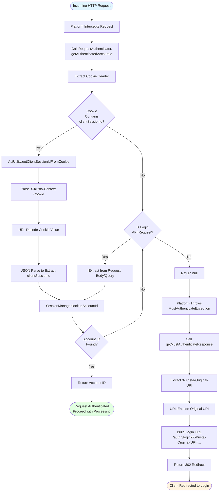

### Cookie Structure and Lifecycle

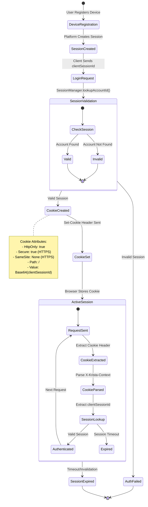

---

## Request Processing Flow

### Complete Request Lifecycle

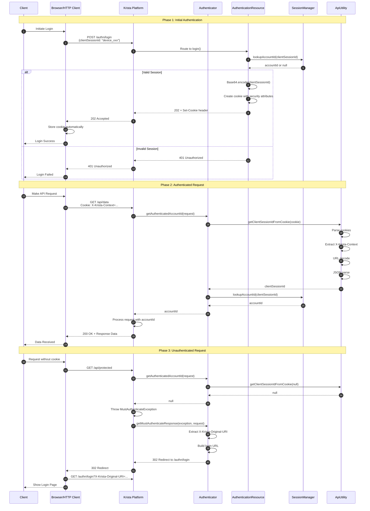

### JavaScript Authenticator Delivery Flow

```mermaid
flowchart LR
    A[Client Request] --> B[GET /authn/authenticator?key=MyAuth]
    B --> C[AuthenticationResource.getAuthenticator]
    C --> D[Load authenticator.js from resources]
    D --> E{Resource<br/>Found?}
    E -->|No| F[Return 404 Not Found]
    E -->|Yes| G[Read file content]
    G --> H[Extract workspace URL from headers]
    H --> I[Prepare template substitutions]
    I --> J[Replace __BASE_URI__<br/>with workspace URL]
    J --> K[Replace __JSAuthFn__<br/>with function name]
    K --> L[Replace __JSWindowVariable__<br/>with window variable]
    L --> M[Set Cache-Control:<br/>private, max-age=604800]
    M --> N[Set Content-Type:<br/>text/javascript]
    N --> O[Return 200 OK + JavaScript]
    O --> P[Client Executes JavaScript]
    P --> Q[window.MyAuth.login available]

    style A fill:#e1f5ff
    style F fill:#ffe1e1
    style Q fill:#e1ffe1
```

---

## Error Handling Architecture

### Error Handling Strategy

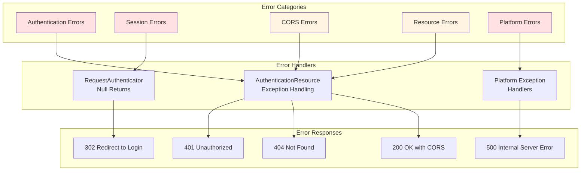

### Error Scenarios and Handling

| Error Scenario | Detection Point | Handler | Response | Recovery |
|----------------|----------------|---------|----------|----------|
| **Invalid Session ID** | `SessionManager.lookupAccountId()` returns null | `AuthenticationResource.login()` | 401 Unauthorized | Client obtains new session ID |
| **Expired Session** | `SessionManager.lookupAccountId()` returns null | `KristaClientRequestAuthenticator` | null → 302 Redirect | Client re-authenticates |
| **Missing Cookie** | `ApiUtility.getClientSessionIdFromCookie()` returns null | `KristaClientRequestAuthenticator` | null → 302 Redirect | Client authenticates |
| **Malformed Cookie** | JSON parse exception in `ApiUtility` | Caught, logged, returns null | null → 302 Redirect | Client clears cookies, re-authenticates |
| **CORS Preflight Failure** | Missing Origin header | `AuthenticationResource.loginOptions()` | 200 OK with CORS headers | Client retries with proper headers |
| **Resource Not Found** | `authenticator.js` not in classpath | `AuthenticationResource.getAuthenticator()` | 404 Not Found | Reinstall extension |
| **SessionManager Unavailable** | Platform service error | Exception propagates | 500 Internal Server Error | Check platform services |
| **Invalid Request Body** | JSON parse error | `AuthenticationResource.login()` | 401 Unauthorized | Client sends valid JSON |

### Error Flow Diagram

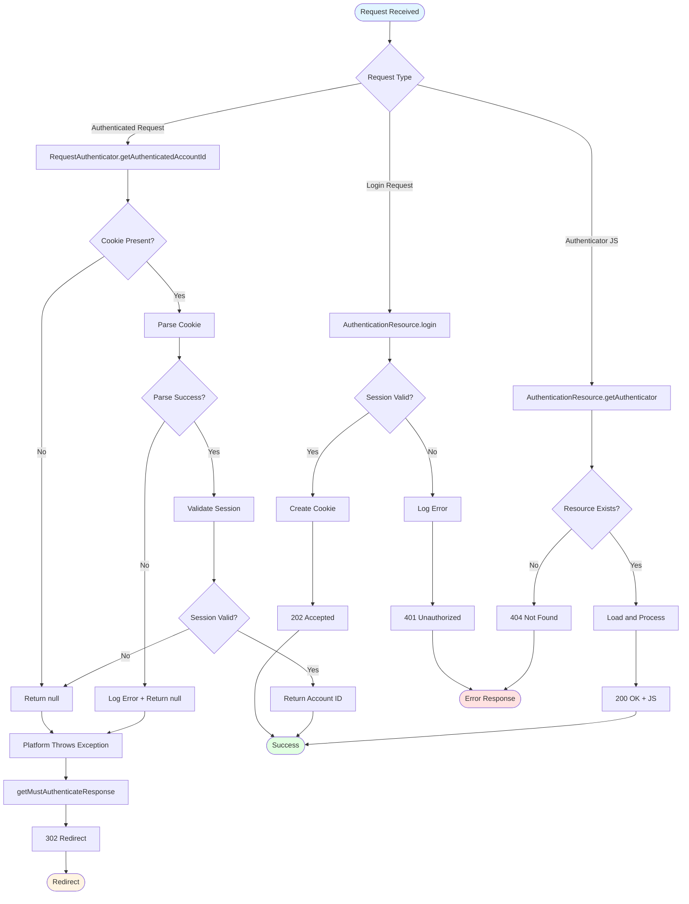

---

## Performance Characteristics

### Performance Metrics

| Operation | Typical Latency | Bottleneck | Optimization Strategy |
|-----------|----------------|------------|----------------------|
| **POST /login** | < 100ms | SessionManager lookup | Platform-level session caching |
| **GET /authenticator** | < 50ms | File I/O | HTTP cache (max-age=604800) |
| **Request Authentication** | < 10ms | Cookie parsing + JSON | Efficient Gson parsing, minimal allocations |
| **Session Validation** | < 20ms | SessionManager query | Platform connection pooling |
| **Cookie Parsing** | < 5ms | String operations | Optimized regex-free parsing |
| **Redirect Generation** | < 5ms | URL encoding | Minimal string operations |

### Performance Architecture

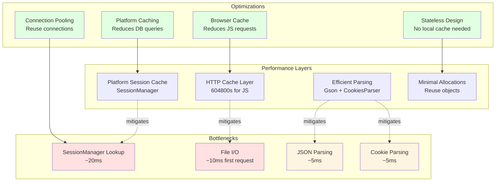

### Scalability Characteristics

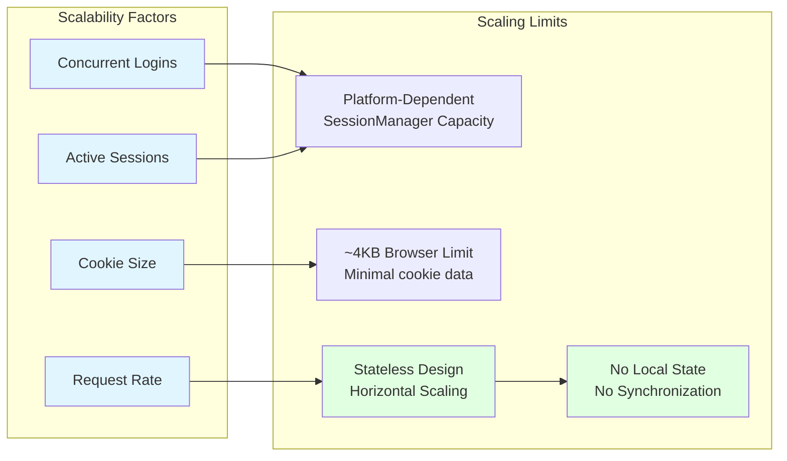

### Performance Best Practices

1. **Client-Side Caching**
   - Cache `GET /authenticator` response for 7 days (604800 seconds)
   - Reduces server load and improves client performance
   - Browser automatically handles cache validation

2. **Session Management**
   - Platform SessionManager handles session caching
   - No local caching needed in extension
   - Stateless design enables horizontal scaling

3. **Efficient Parsing**
   - Use Gson for JSON parsing (optimized for performance)
   - CookiesParser for cookie parsing (JAX-RS standard)
   - Minimal string allocations

4. **Connection Pooling**
   - Platform manages connection pooling to SessionManager
   - Reuse connections for session lookups
   - Reduces connection overhead

5. **Monitoring Metrics**
   - Track SessionManager lookup latency
   - Monitor authentication failure rates
   - Alert on high redirect rates (indicates session issues)

---

## Security Architecture

### Security Layers

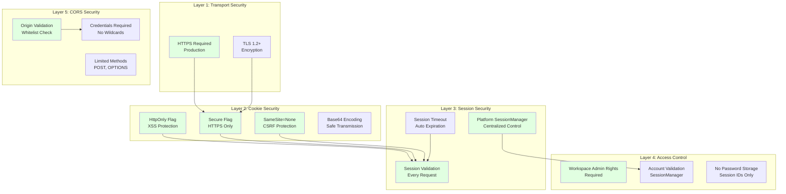

### Threat Model and Mitigations

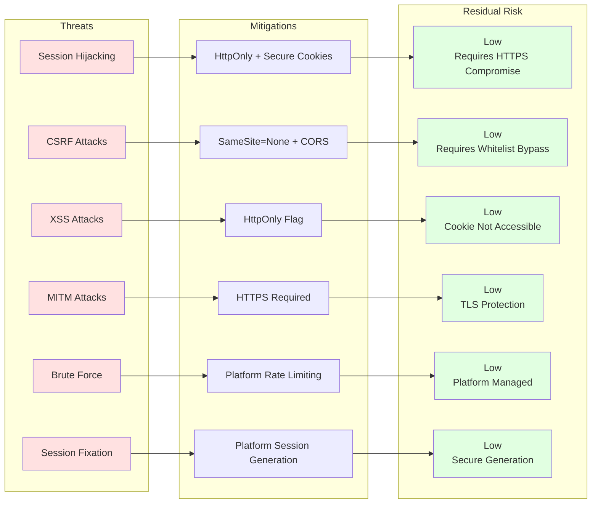

### Security Configuration

| Security Feature | Configuration | Purpose | Impact |
|------------------|---------------|---------|--------|
| **HttpOnly Cookie** | Always enabled | Prevent JavaScript access to cookie | Mitigates XSS attacks |
| **Secure Cookie** | Enabled on HTTPS | HTTPS-only transmission | Mitigates MITM attacks |
| **SameSite Attribute** | None (HTTPS) or not set (HTTP) | Explicit cross-site intent | Mitigates CSRF attacks |
| **CORS Validation** | Origin whitelist required | Restrict cross-origin access | Prevents unauthorized origins |
| **Session Timeout** | Platform-managed | Auto-expire inactive sessions | Reduces exposure window |
| **Admin Rights** | Required for extension | Controlled account management | Limits privilege escalation |
| **No Password Storage** | Session IDs only | Avoid credential exposure | Reduces attack surface |
| **Base64 Encoding** | Cookie values | Safe cookie transmission | Prevents special char issues |

### Security Best Practices

1. **Always Use HTTPS in Production**
   - Secure flag requires HTTPS
   - Prevents cookie interception
   - Enables SameSite=None for cross-origin

2. **Whitelist CORS Origins**
   - Never use wildcard (*) with credentials
   - Validate origin against platform whitelist
   - Log unauthorized origin attempts

3. **Monitor Authentication Activity**
   - Track failed authentication attempts
   - Alert on unusual session patterns
   - Monitor SessionManager errors

4. **Regular Security Audits**
   - Review workspace admin access
   - Audit session timeout policies
   - Validate CORS configuration

5. **Input Validation**
   - Validate all request parameters
   - Sanitize session IDs before logging
   - Handle malformed cookies gracefully

---

## Deployment Architecture

### Deployment Model

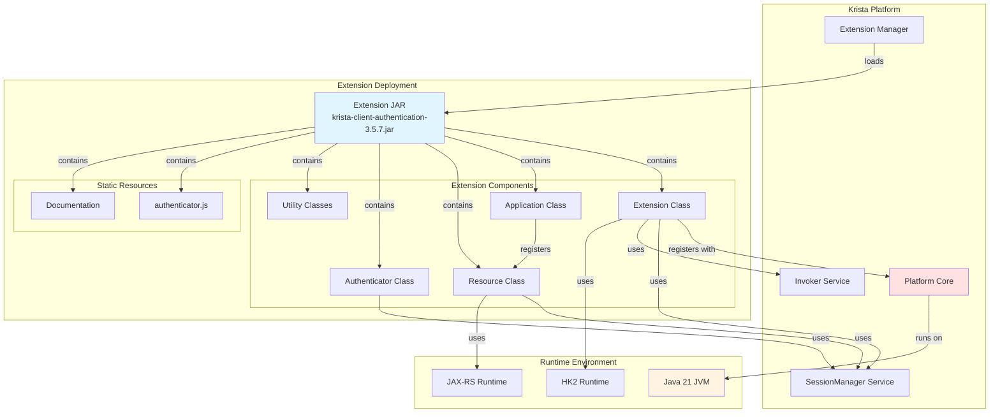

### Installation Flow

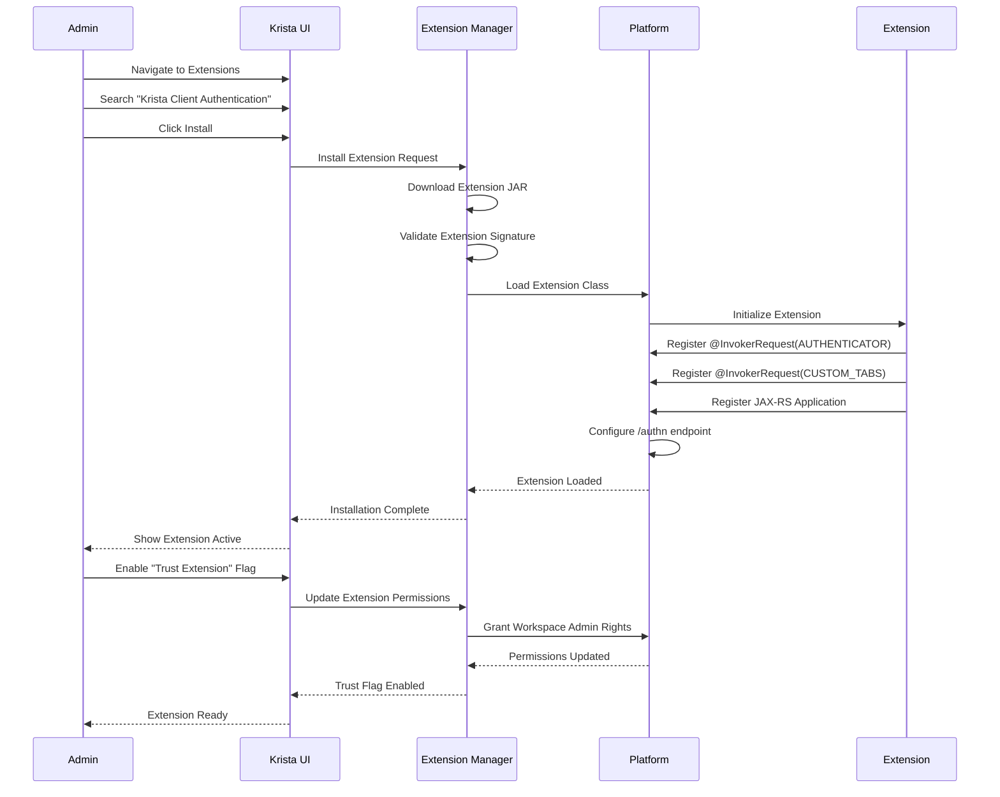

### Runtime Architecture

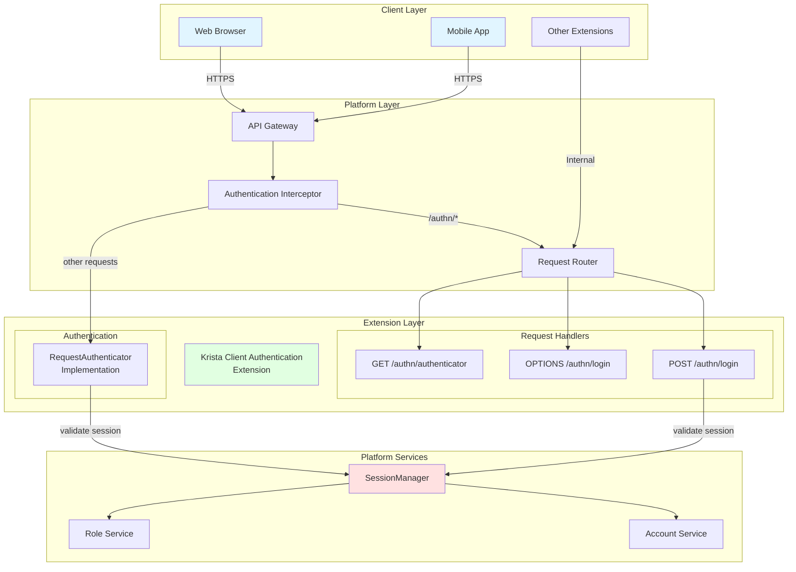

---

## Limitations and Constraints

### Architectural Limitations

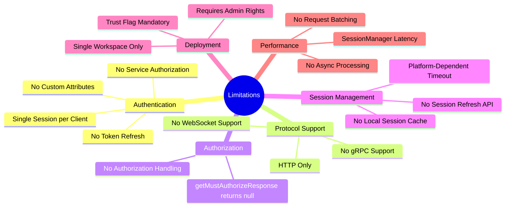

### Detailed Limitations

| Category | Limitation | Impact | Workaround |
|----------|-----------|--------|------------|
| **Session Management** | No token refresh mechanism | Users must re-authenticate on session expiry | Implement session monitoring in client |
| **Session Management** | Single session per client ID | Multiple sessions require multiple client IDs | Use different client IDs for different contexts |
| **Authentication** | No custom attribute fields | `getAttributeFields()` returns empty map | Store attributes in platform account service |
| **Authentication** | No service authorization | `setServiceAuthorization()` returns false | Use platform service accounts |
| **Protocol Support** | HTTP protocol only | `getSupportedProtocols()` returns HTTP only | Not applicable for current use cases |
| **Authorization** | No authorization handling | `getMustAuthorizeResponse()` returns null | Implement authorization in application layer |
| **Deployment** | Requires workspace admin rights | Cannot function without trust flag | Must enable trust flag in extension settings |
| **Performance** | SessionManager lookup latency | ~20ms per request | Platform-level optimization only |
| **Scalability** | Platform-dependent session storage | Limited by platform capacity | Scale platform infrastructure |
| **Cookie Size** | ~4KB browser limit | Minimal data in cookie (session ID only) | Use session ID as reference, store data server-side |

### Constraint Matrix

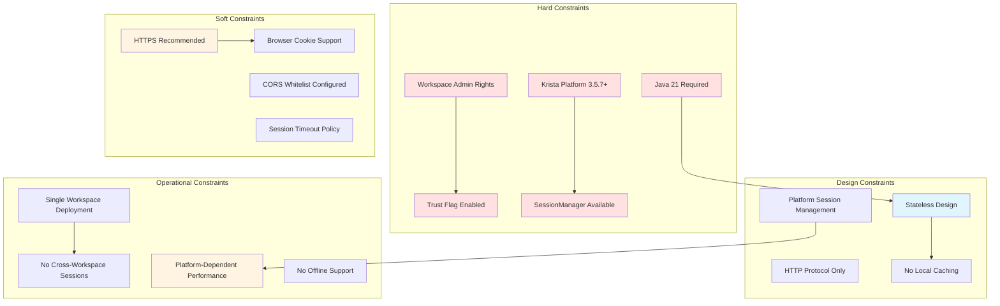

### Feature Support Matrix

| Feature | Supported | Implementation | Notes |
|---------|-----------|----------------|-------|
| **Session-Based Auth** | ✅ Yes | Cookie-based sessions | Primary authentication method |
| **Token-Based Auth** | ❌ No | Not implemented | Use session IDs instead |
| **OAuth 2.0** | ❌ No | Not implemented | Platform-level feature |
| **SAML** | ❌ No | Not implemented | Platform-level feature |
| **Multi-Factor Auth** | ❌ No | Not implemented | Platform-level feature |
| **Session Refresh** | ❌ No | Not implemented | Re-authenticate on expiry |
| **Custom Attributes** | ❌ No | Returns empty map | Use platform account service |
| **Service Authorization** | ❌ No | Returns false | Use platform service accounts |
| **HTTP Protocol** | ✅ Yes | Full support | Primary protocol |
| **WebSocket** | ❌ No | Not supported | Use HTTP polling |
| **gRPC** | ❌ No | Not supported | Use HTTP REST |
| **CORS Support** | ✅ Yes | Dynamic origin handling | Requires whitelist configuration |
| **Cookie Security** | ✅ Yes | HttpOnly, Secure, SameSite | Full security attributes |
| **Redirect Handling** | ✅ Yes | 302 redirect to login | Automatic unauthenticated handling |
| **JavaScript Client** | ✅ Yes | Delivered via GET /authenticator | Cached for 7 days |
| **Mobile Support** | ✅ Yes | Cookie-based auth | Requires cookie storage |
| **Extension Dependency** | ✅ Yes | @Dependency annotation | Can be used by other extensions |
| **Custom Tabs** | ✅ Yes | Documentation tab | Static resource serving |
| **Horizontal Scaling** | ✅ Yes | Stateless design | No local state |
| **Session Clustering** | ⚠️ Platform | SessionManager handles | Platform-dependent |

### Performance Constraints

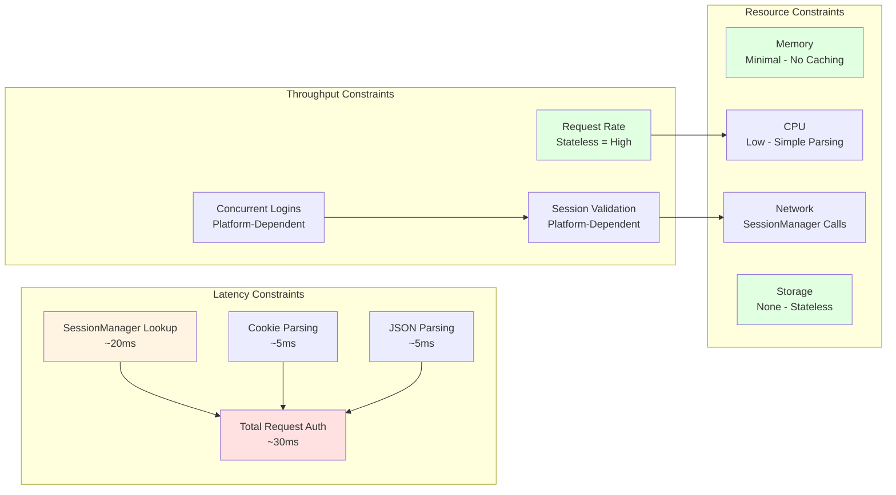

### Operational Constraints

1. **Deployment Constraints**
   - Must be deployed to Krista workspace
   - Cannot run standalone
   - Requires platform services (SessionManager, Invoker)
   - Single workspace deployment only

2. **Configuration Constraints**
   - JAX-RS ID cannot be changed after deployment
   - Domain ID is fixed
   - Admin rights requirement cannot be disabled
   - Static resource path is fixed

3. **Runtime Constraints**
   - Depends on platform SessionManager availability
   - No graceful degradation if SessionManager unavailable
   - No offline mode support
   - No request queuing or batching

4. **Integration Constraints**
   - Other extensions must use @Dependency annotation
   - Cannot be used outside Krista platform
   - CORS origins must be whitelisted at platform level
   - No custom authentication schemes

### Mitigation Strategies

```mermaid
flowchart TB
    subgraph "Limitations"
        L1[No Session Refresh]
        L2[SessionManager Latency]
        L3[Single Session per Client]
        L4[No Custom Attributes]
    end

    subgraph "Mitigations"
        M1[Client-Side Session Monitoring<br/>Proactive Re-auth]
        M2[Platform-Level Caching<br/>Connection Pooling]
        M3[Multiple Client IDs<br/>Per Context]
        M4[Platform Account Service<br/>Store Attributes]
    end

    subgraph "Best Practices"
        B1[Monitor Session Expiry<br/>Refresh Before Timeout]
        B2[Implement Retry Logic<br/>Exponential Backoff]
        B3[Use Separate Sessions<br/>For Different Apps]
        B4[Leverage Platform APIs<br/>For Extended Data]
    end

    L1 --> M1 --> B1
    L2 --> M2 --> B2
    L3 --> M3 --> B3
    L4 --> M4 --> B4

    style L1 fill:#ffe1e1
    style L2 fill:#ffe1e1
    style L3 fill:#ffe1e1
    style L4 fill:#ffe1e1
    style M1 fill:#fff4e1
    style M2 fill:#fff4e1
    style M3 fill:#fff4e1
    style M4 fill:#fff4e1
    style B1 fill:#e1ffe1
    style B2 fill:#e1ffe1
    style B3 fill:#e1ffe1
    style B4 fill:#e1ffe1
```

---

## Appendix

### Technology Stack

| Component | Technology | Version | Purpose |
|-----------|-----------|---------|---------|
| **Language** | Java | 21 | Primary implementation language |
| **Build Tool** | Gradle | 8.5+ | Build automation |
| **DI Framework** | HK2 | 3.0.5 | Dependency injection |
| **REST Framework** | JAX-RS | 3.1.0 | REST API implementation |
| **JSON Library** | Gson | 2.10.1 | JSON parsing and serialization |
| **Logging** | SLF4J | 2.0.9 | Logging abstraction |
| **Testing** | JUnit Jupiter | 5.10.1 | Unit testing |
| **Mocking** | Mockito | 5.7.0 | Test mocking |
| **Code Coverage** | JaCoCo | 0.8.11 | Coverage reporting |
| **Platform APIs** | Krista APIs | 1.0.121-rc1 | Platform integration |

### Key Interfaces and Classes

```java
// Extension Entry Point
@Extension
public class KristaClientAuthenticationExtension {
    @InvokerRequest(InvokerRequest.Type.AUTHENTICATOR)
    public RequestAuthenticator getAuthenticatedAccountId();
}

// Request Authenticator Implementation
public class KristaClientRequestAuthenticator implements RequestAuthenticator {
    String getScheme();
    Set<String> getSupportedProtocols();
    String getAuthenticatedAccountId(ProtoRequest request);
    ProtoResponse getMustAuthenticateResponse(MustAuthenticateException cause, ProtoRequest request);
}

// REST API Resource
@Path("/")
public class AuthenticationResource {
    @POST @Path("/login")
    Response login(Map<String, String> loginInput);

    @OPTIONS @Path("/login")
    Response loginOptions();

    @GET @Path("/authenticator")
    Response getAuthenticator(@QueryParam("key") String key);
}

// Utility Classes
public class ApiUtility {
    static String getClientSessionIdFromCookie(String cookie);
    static String parseClientSessionIdFromCookie(String cookie);
}

public class ApiConstants {
    static final String X_KRISTA_SESSION_ID;
    static final String X_KRISTA_ORIGINAL_URL;
    static final String X_KRISTA_CONTEXT;
    static final String CLIENTSESSIONID;
}
```

### Configuration Reference

```yaml
# Extension Configuration
extension:
  name: "Krista Client Authentication"
  version: "3.5.7"
  domain_id: "catEntryDomain_db053e8f-a194-4dde-aa6f-701ef7a6b3a7"
  domain_name: "Authentication"
  jaxrs_id: "authn"
  admin_rights: true
  java_version: 21

# Endpoints
endpoints:
  - method: POST
    path: /authn/login
    auth_required: false
  - method: OPTIONS
    path: /authn/login
    auth_required: false
  - method: GET
    path: /authn/authenticator
    auth_required: false

# Security
security:
  cookie:
    http_only: true
    secure: true  # HTTPS only
    same_site: "None"  # HTTPS, or not set for HTTP
    path: "/"
  cors:
    allow_credentials: true
    allow_methods: ["POST", "OPTIONS"]
    allow_headers: ["Content-Type", "Accept"]

# Performance
performance:
  cache:
    authenticator_js: 604800  # 7 days
  timeouts:
    session_lookup: 5000  # 5 seconds
```

### Glossary

- **SessionManager**: Platform service that manages user sessions and account lookups
- **Invoker**: Platform service that executes requests and provides routing information
- **RequestAuthenticator**: Interface for implementing custom authentication logic
- **InvokerRequest**: Extension capability provided to the platform
- **clientSessionId**: Unique identifier for a client session, obtained from device registration
- **X-Krista-Context**: Cookie name containing session context information
- **CORS**: Cross-Origin Resource Sharing - mechanism for cross-domain requests
- **HttpOnly**: Cookie attribute preventing JavaScript access
- **Secure**: Cookie attribute requiring HTTPS transmission
- **SameSite**: Cookie attribute controlling cross-site request behavior
- **Trust Extension Flag**: Platform setting granting workspace admin rights to extension

---

## Document Revision History

| Version | Date | Author | Changes |
|---------|------|--------|---------|
| 1.0 | 2026-01-16 | Architecture Team | Initial architecture documentation with Mermaid diagrams |

---

**End of Architecture Documentation**

