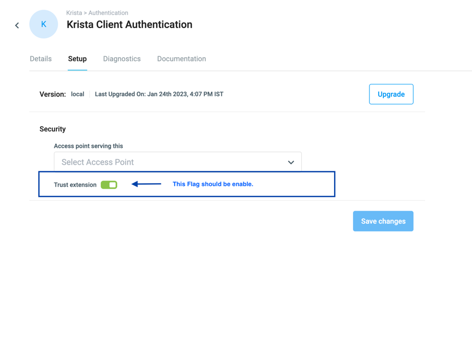

# Setup Instructions

## Overview

The Krista Client Authentication extension requires specific configuration to function properly. This guide walks you through the complete setup process.

---

## Prerequisites

Before setting up the extension, ensure you have:

- ✅ Krista Platform version 3.5.7 or higher
- ✅ Workspace administrator access
- ✅ Extension installed in your Krista workspace
- ✅ HTTPS configured (recommended for production)

---

## Step 1: Install the Extension

1. Navigate to your Krista workspace
2. Go to **Setup** → **Extensions**
3. Search for "Krista Client Authentication"
4. Click **Install** button
5. Wait for installation to complete

---

## Step 2: Enable Trust Extension Flag

**This is the most critical step.** The extension requires workspace admin rights to function.

### Why Trust Extension Flag is Required

The Krista Client Authentication extension needs workspace admin rights to:
- Create and manage user accounts
- Assign user roles and permissions
- Access SessionManager for session validation
- Manage authentication across the workspace

### How to Enable Trust Extension Flag

1. Navigate to **Setup** → **Extensions**
2. Locate **Krista Client Authentication** in the extensions list
3. Click on the extension to open its details
4. Find the **Trust Extension** toggle/checkbox
5. **Enable** the Trust Extension flag
6. Save the configuration



> **⚠️ Important:** The extension will NOT function without the Trust Extension flag enabled. All authentication requests will fail if this flag is not set.

---

## Step 3: Verify Extension Status

After enabling the Trust Extension flag, verify the extension is active:

### Check Extension Status

1. Go to **Setup** → **Extensions**
2. Verify **Krista Client Authentication** shows status: **Active**
3. Check that the Trust Extension flag shows as **Enabled**

### Test Extension Endpoints

Test that the extension endpoints are accessible:

#### Test Authenticator JavaScript Endpoint

Open in browser or use curl:
```bash
curl https://your-workspace.krista.com/authn/authenticator
```

**Expected Response:** JavaScript code should be returned

#### Test Login Endpoint (OPTIONS)

```bash
curl -X OPTIONS https://your-workspace.krista.com/authn/login \
  -H "Origin: https://your-app.com" \
  -v
```

**Expected Response:** HTTP 200 with CORS headers

---

## Step 4: Configure CORS (Optional)

If you're integrating with external applications, configure CORS settings:

### Whitelist Your Application Origin

1. Navigate to **Setup** → **Security** → **CORS**
2. Add your application's origin (e.g., `https://your-app.com`)
3. Ensure the origin is whitelisted for cross-origin requests
4. Save the configuration

### Test CORS Configuration

```bash
curl -X POST https://your-workspace.krista.com/authn/login \
  -H "Origin: https://your-app.com" \
  -H "Content-Type: application/json" \
  -d '{"clientSessionId":"test"}' \
  -v
```

**Expected Response:** CORS headers should be present in the response

---

## Step 5: Obtain Client Session ID

To authenticate users, you need a valid client session ID from Krista device registration.

### How to Obtain Client Session ID

1. Use Krista's device registration API
2. Register a device for your application
3. Receive a `clientSessionId` in the format: `device_<uuid>`
4. Store this session ID securely in your application

**Example Session ID:** `device_bbafe0cf-38e1-490b-9f00-d31aafadfe`

---

## Step 6: Test Authentication

Test the complete authentication flow:

### Test Login Request

```bash
curl -X POST https://your-workspace.krista.com/authn/login \
  -H "Content-Type: application/json" \
  -H "Origin: https://your-app.com" \
  -d '{"clientSessionId":"device_bbafe0cf-38e1-490b-9f00-d31aafadfe"}' \
  -v
```

### Expected Response

```
HTTP/1.1 202 Accepted
Access-Control-Allow-Credentials: true
Access-Control-Allow-Origin: https://your-app.com
Access-Control-Allow-Methods: POST,OPTIONS
Access-Control-Allow-Headers: Content-Type, Accept
Set-Cookie: clientSessionId=<base64-encoded>;HttpOnly;path=/;SameSite=None;Secure
```

---

## Configuration Checklist

Use this checklist to ensure proper setup:

- [ ] Extension installed in Krista workspace
- [ ] Extension status shows as **Active**
- [ ] **Trust Extension flag is ENABLED** ⚠️ Critical
- [ ] GET /authn/authenticator endpoint returns JavaScript
- [ ] OPTIONS /authn/login endpoint returns CORS headers
- [ ] CORS origins whitelisted (if using cross-origin requests)
- [ ] Valid client session ID obtained from device registration
- [ ] POST /authn/login returns 202 Accepted with Set-Cookie header
- [ ] HTTPS configured (for production environments)

---

## Troubleshooting Setup Issues

### Extension Not Active

**Problem:** Extension shows as inactive or disabled

**Solution:**
1. Check extension installation logs
2. Verify Krista platform version compatibility (3.5.7+)
3. Reinstall the extension if necessary

### Trust Extension Flag Not Available

**Problem:** Cannot find Trust Extension toggle

**Solution:**
1. Verify you have workspace administrator access
2. Check that you're viewing the correct extension details page
3. Contact your Krista administrator for permissions

### Endpoints Return 404

**Problem:** /authn/login or /authn/authenticator return 404

**Solution:**
1. Verify extension is Active
2. Check that Trust Extension flag is enabled
3. Restart the Krista workspace if necessary
4. Check extension logs for initialization errors

### Authentication Fails with 401

**Problem:** Login request returns 401 Unauthorized

**Solution:**
1. Verify client session ID is valid
2. Check that session hasn't expired
3. Obtain a new session ID from device registration
4. Verify SessionManager service is running

### CORS Errors

**Problem:** Browser shows CORS errors

**Solution:**
1. Whitelist your application origin in Krista CORS settings
2. Ensure `credentials: 'include'` is set in fetch requests
3. Verify OPTIONS preflight request succeeds
4. Check that origin header matches whitelisted origin exactly

---

## Next Steps

After successful setup:

1. **Integration:** Follow the [Integration Guide](IntegrationGuide.md) to integrate with your application
2. **API Reference:** Review [Login API](LoginAPI.md) and [Authenticator JavaScript](AuthenticatorJavaScript.md) documentation
3. **Security:** Review [Authentication](Authentication.md) for security best practices
4. **Troubleshooting:** Bookmark [Troubleshooting](Troubleshooting.md) for common issues

---

## Support

If you encounter issues during setup:

1. Check the [Troubleshooting Guide](Troubleshooting.md)
2. Review extension logs in Krista workspace
3. Verify all prerequisites are met
4. Contact your Krista administrator or support team

---

**Remember:** The Trust Extension flag MUST be enabled for the extension to function. This is the most common setup issue.

